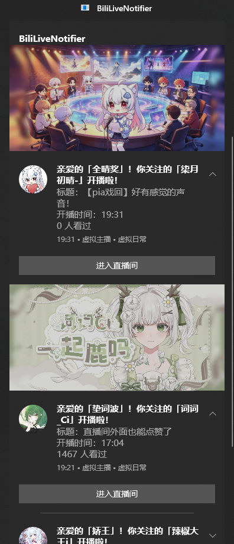

# BiliLiveNotifier

**B 站开播实时通知工具** — 监控你关注的主播，开播/下播时通过 Windows 系统 Toast 弹窗提醒，支持多主播并发监控、配置热重载、图片缓存。

---

## 功能一览

| 功能 | 说明 |
|------|------|
| 🔴 **开播通知** | 检测到主播开播（含轮播），弹出 Toast 通知，包含主播头像、封面图、直播间标题、分区、开播时间 |
| ⬛ **下播通知** | 主播下播时自动推送下播通知 |
| 🎂 **生日提醒** | 每日自动检查主播生日，生日当天开播通知为特别文案 |
| 👥 **多主播并发** | 配置多个 UID，每个主播独立异步监控互不干扰 |
| ⚙️ **配置热重载** | 修改 `data/config.json` 无需重启，自动感知并差量增删监控实例 |
| 🖼️ **图片缓存** | 头像和封面图自动缓存到本地，避免重复下载，开播通知秒出图 |
| 📋 **日志记录** | 每日日志文件自动滚动，保留 7 天，控制台 + 文件双输出 |
| 🧪 **单元测试** | 23 个 xUnit 测试用例，覆盖 API 客户端、字段映射、模型解析 |

---

## 环境要求

- **操作系统**: Windows 10 (17763+) 或更高（需支持 WinRT Toast 通知）
- **运行时**: .NET 8.0 SDK 或运行时
- **外部依赖**: 无（所有功能自包含）

---

## 快速开始

### 1. 获取代码

```bash
git clone https://github.com/llz12/BiliLiveNotifier.git
cd BiliLiveNotifier
```

### 2. 配置监控目标

运行后会自动生成 `bin/Debug/net8.0-windows*/data/config.json`，编辑它：

```json
{
  "uids": [6, 123456],
  "auto_start": true,
  "check_interval": 30,
  "live_check_interval": 60,
  "birthday_text": true,
  "skip_default_birthday": true
}
```

| 字段 | 默认值 | 说明 |
|------|--------|------|
| `uids` | `[6]` | 要监控的 B 站用户 UID 列表 |
| `auto_start` | `false` | 保留字段（当前无法自动启动） |
| `check_interval` | `30` | 未开播时轮询间隔（秒） |
| `live_check_interval` | `60` | 直播中轮询间隔（秒） |
| `birthday_text` | `true` | 生日当天是否使用特别通知文案 |
| `skip_default_birthday` | `true` | 是否过滤生日为 `01-01`（B 站默认值的用户） |

### 3. 运行

```bash
dotnet run --project BiliLiveNotifier.csproj
```

程序启动后会：
1. 加载配置 → 获取每个 UID 的 `roomId`
2. 并发监控所有主播
3. 开播/下播时弹出 Windows Toast 通知
4. 按 `Ctrl+C` 优雅退出

### 4. 运行测试

```bash
dotnet test Tests/BiliLiveNotifier.Tests.csproj
```

---

## 项目结构

```
BiliLiveNotifier/
├── Program.cs                   # 入口：初始化 → 启动监控 → 等待退出
├── Models.cs                    # API 响应模型 + 配置模型 + JSON 扩展
├── LLog.cs                      # 轻量级日志库（文件+控制台）
│
├── Core/
│   ├── LiveMonitor.cs           # 核心：监控引擎 + 环境管理器
│   ├── ApiClient.cs             # B 站 API 客户端（配置驱动、重试、字段映射）
│   ├── ConfigManager.cs         # 配置管理（JSON 文件 + 热重载）
│   ├── Notifier.cs              # Windows Toast 通知管理器
│   └── ToastImageCache.cs       # 图片本地缓存（SHA1 去重、原子写入）
│
├── Tests/
│   ├── BiliLiveNotifier.Tests.csproj
│   ├── MockHttpMessageHandler.cs     # HTTP mock 处理器
│   ├── Core/
│   │   ├── ApiClientTests.cs         # API 客户端测试（11 个用例）
│   │   └── JsonNodeExtensionsTests.cs # JSON 路径扩展测试（9 个用例）
│   └── Models/
│       └── ApiModelsTests.cs         # API 响应模型测试（4 个用例）
│
├── api_endpoints.json           # B 站 API 端点配置 + 字段映射
├── api_doc.json                 # API 接口文档（供参考）
└── data/config.json             # 用户配置（首次运行自动生成）
```

---


## Toast 通知样式



开播通知包含：
- 📌 分组标题：`BiliLiveNotifier`
- 🖼️ Hero 封面图（直播间封面）
- 👤 圆形头像（主播头像）
- 📝 主标题：开播文案（生日当天有特供版）
- 📄 副标题：直播间标题 + 开播时间 + 观看人数
- 🏷️ 归属文本：分区信息
- 🔘 按钮：「进入直播间」

<br clear="all">

---


## License

MIT License
